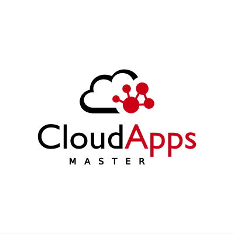

  

# Escalabilidad y tolerancia a fallos en Kubernetes

## Propósito

En la actualidad, todos somos conscientes de que nuestras aplicaciones tienen que estar siempre disponibles y con un rendimiento aceptable aunque tengan una alta carga, ya que, de lo contrario, podemos perder clientes o nos puede ocasionar perdidas millonarias porque nuestros servicios no están disponibles o porque no cumplimos con la SLA.

Para que esto no ocurra, es importante estudiar y entender todo lo que podemos hacer para intentar minimizar todos estos posibles riesgos.

En los siguientes enlaces se muestran los estudios sobre la escalabalidad y tolerancia a fallos de una serie de aplicaciones con distintos estilos arquitectónicos, desplegadas todas ellas en un clúster de Kubernetes.

Contenido:
* [Web Stateless]
* Web Statefulset con persistencia relacional
  * [My SQL Standalone]
  * [My SQL Replicaset]
  * [My SQL Standalone con JCache]
* Web Statefulset con persistencia no relacional
  * [MongoDB Standalone]
  * [MongoDB Replicaset]
  * [MongoDB Standalone con caché redis]
* Web con colas
  * [RabbitMQ]

> Cada una de las aplicaciones sometidas a estudio contiene los manifiestos de despliegue, código fuente y Test Plans de JMeter con las pruebas realizadas sobre las mismas.
        
  [//]: # (References)

  [Web Stateless]: <webStatelessGatos/Readme.md#WEB STATELESS GATOS>
  [My SQL Standalone]: <webMySQL/standalone/Readme.md#WEB MYSQL STANDALONE>
  [My SQL Replicaset]: <webMySQL/replicaset/Readme.md#WEB MYSQL REPLICASET>
  [My SQL Standalone con JCache]: <webJcache/README.md#WEB JCACHE CON HAZLECAST>
  [MongoDB Standalone]: <webMongo/standalone/README.md#WEB MONGODB STANDALONE>
  [MongoDB Replicaset]: <webMongo/replicaset/README.md#WEB MONGODB REPLICASET>
  [MongoDB Standalone con caché redis]: <webMongoRedis/README.md#WEB MONGODB CON CACHÉ REDIS>
  [RabbitMQ]: <RabbitMQ/README.md#rabbitmq>

