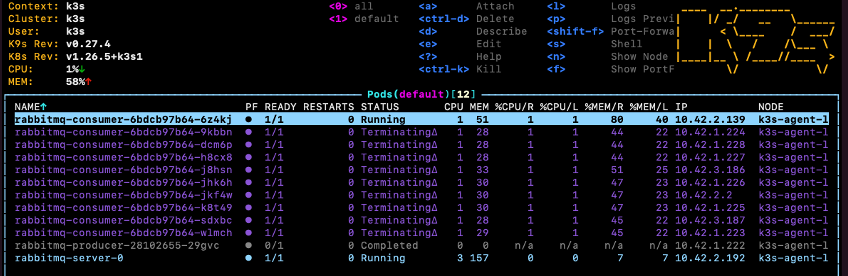

# RABBITMQ 

En el siguiente ejemplo vamos a estudiar diferentes mecanismos de autoescalado en un clúster de RabbitMQ, concretamente los siguientes:

- HPA basado en custom metrics (con instalación de Prometheus para la recogida de métricas y visualización en Grafana)
- KEDA:
    - Scaler RabbitMQ Queue basado en external metrics
    - Scaler Cron
    


## ARQUITECTURA

Desde el punto de vista arquitectónio, la aplicación que vamos a montar para el estudio presenta la siguiente estructura:


## INSTALACIÓN

## 1. Despliegue de Prometheus para la recolección de las métricas de la RabbitMQ

Instalamos el operador de prometheus:
```
kubectl apply -f https://raw.githubusercontent.com/prometheus-operator/prometheus-operator/master/bundle.yaml
```

Creamos el namespace monitoring:
```
kubectl create ns monitoring
```

Desplegamos prometheus:
```
kubectl apply -k ../../../prometheus-operator -n monitoring
```


## 2. Despliegue de RabbitMQ

Instalamos el operador de RabbitMQ:
```
kubectl apply -f https://github.com/rabbitmq/cluster-operator/releases/latest/download/cluster-operator.yml
```

Desplegamos el clúster de RabbitMQ con RabbitmqCluster, CRD definido en el fichero yaml previamente desplegado
```
kubectl apply -f .\rabbitmq\rabbitmq-cluster.yaml
```

Una vez hemos desplegado el clúster de RabbitMQ, nos conectamos al mismo para habilitar el plugin *rabbitmq_prometheus* en todos los nodos, lo que permite el envío de las métricas de la RabbitMQ a Prometheus:
```
rabbitmq-plugins enable rabbitmq_prometheus
```


Verificamos que el plugin se ha habilitado correctamente
```
rabbitmq-plugins list
```


Consultamos el intervalo de tiempo en el que serán recogidas las métricas de la RabbitMQ, por defecto cada 5 segundos
```
rabbitmq-diagnostics environment | grep collect_statistics_interval
```


Desplegamos un pod monitor para enviar las métricas de RabbitMQ a Prometheus:
```
kubectl apply -f .\rabbitmq\pod-monitor-rabbitmq.yaml  
```

Para verificar que el pod monitor se ha instalado correctamente y Prometheus está recolectando las métricas de la RabbitMQ, podemos acceder a la UI de Prometheus (servicio expuesto en el puerto 9090) y verificar que en la pestaña Targets todos los endpoints están **Up**:


Una vez tenemos la recolección y envío de métricas a Prometheus activados, procedemos a desplegar un productor y un consumidor para enviar y procesar mensajes de la cola 

Desplegamos un productor de mensajes mediante un Cronjob, que publicará 20 mensajes en la RabbitMQ cada 5 minutos:
```
kubectl apply -f .\rabbitmq-producer-cronjob.yaml
```

Desplegamos un consumidor suscrito a la cola de la RabbitMQ que consumirá un mensaje cada 10 segundos:
```
kubectl apply -f .\rabbitmq-consumer-deployment.yaml
```


## 3. Despliegue de Grafana para la visualización de las métricas

Instalamos Grafana para visualizar el número de mensajes encolados:
```
kubectl create -f ./grafana/config
```

Accedemos a la UI de Grafana, a través del servicio expuesto en el puerto 3000 (username: admin, password: admin), e importamos un dashboard que trae Grafana por defecto, *RabbitMQ Overview* para visualizar los datos:


## 4. Despliegue de un adaptador de Prometheus para la recogida de métricas custom

Desplegamos un adaptador de Prometheus para hacer accesibles las métricas custom por API, a través de custom.metrics.k8s.io API:

Como primer paso, preparamos el certificado HTTPS TLS para el api server, mediante los siguientes comadnos:
```
openssl req -new -newkey rsa:4096 -x509 -sha256 -days 365 -nodes -out serving.crt -keyout serving.key -subj "/C=CN/CN=custom-metrics-apiserver.monitoring.svc.cluster.local"
kubectl create secret generic -n monitoring cm-adapter-serving-certs --from-file=serving.key=./serving.key --from-file=serving.crt=./serving.crt
```

Una vez hemos creado el certifcado, desplegamos los manifiestos con la service account, roles, configuración, deployment y servicio necesarios para crear el adaptador de métricas custom:
```
kubectl create -f ./custom-metrics-api
```

Confirmamos que el servidor de métricas custom está accesible:
```
kubectl get --raw /apis/custom.metrics.k8s.io/v1beta1
```


## 5. Autoescalado mediante HPA

Una vez tenemos habilitado el envío de las métricas custom desde nuestro clúster de RabbitMQ a Prometheus, y la visualización de los datos mediante el dashboard de Grafana, vamos a escalar el clúster de RabbitMQ por una de estas métricas custom, en nuestro caso, la métrica *rabbitmq_queue_messages*.

Confirmamos que se están recolectando datos de esta métrica:
```
kubectl get --raw "/apis/custom.metrics.k8s.io/v1beta1/namespaces/default/pods/*/rabbitmq_queue_messages"
```

Obtendremos una respuesta como  esta:
```
{
    "kind":"MetricValueList",
    "apiVersion":"custom.metrics.k8s.io/v1beta1",
    "metadata":
    {
        "selfLink":"/apis/custom.metrics.k8s.io/v1beta1/namespaces/default/pods/%2A/rabbitmq_queue_messages"
    },
    "items": [
        {
            "describedObject": {
                "kind":"Pod","namespace":"default","name":"rabbitmq-server-0","apiVersion":"/v1"
            },
            "metricName":"rabbitmq_queue_messages",
            "timestamp":"2023-05-28T20:18:20Z","value":"2"
        }
    ]
}
```

Accedemos a la UI de Prometheus para verificar que se están llegando los datos sobre la métrica:


Desplegamos el HPA que autoescala el número de pods del consumidor en función del valor de la métrica custom *rabbitmq_queue_messages*:
```
kubectl apply -f rabbitmq-consumer-hpa.yaml
```

Podemos ver como, según se van produciendo mensajes, el número de pods del consumidor va aumentando (hasta un máximo 10 réplicas, que hemos definido en el HPA); mientras que, una vez que los mensajes son consumidos, el número de pods del consumidor va disminuyendo (hasta mínimo de 1 réplica, que hemos definido en el HPA):


Si nos fijamos en el dashboard de Grafana, también vemos este aumento de réplicas del consumidor reflejado en las gráficas:


Y la reducción a un sola réplica cuando todos los mensajes son consumidos:


> Se puede encontrar un vídeo demostrativo con los pasos comentados anteriormente en el siguiente enlace: [demo](./Images/Rabbitmq-demo.MOV)


## 6. Autoescalado mediante KEDA

Estudiamos el escalado mediante KEDA, mecanismo que permite crear un HPA en función de determinados eventos. La arquitectura general de KEDA es la siguiente:


### 6.1. Instalación de KEDA

Instalamos KEDA mediante Helm:
Añadimos el repo de Helm
```
helm repo add kedacore https://kedacore.github.io/charts
```

Actualizamos el repo de Helm:
```
helm repo update
```

Instalamos el KEDA Helm chart:
```
kubectl create namespace keda
helm install keda kedacore/keda --namespace keda
```

Una vez tenemos KEDA instalado, tenemos acceso a consultar métricas externas por API, expuestas por el KEDA metrics server. Comprobamos que el KEDA metrics server está accesible:
```
kubectl get --raw "/apis/external.metrics.k8s.io/v1beta1"
```

Obtendremos una respuesta como la siguiente:
```
{
  "kind": "APIResourceList",
  "apiVersion": "v1",
  "groupVersion": "external.metrics.k8s.io/v1beta1",
  "resources": [
    {
      "name": "s0-rabbitmq-queueName",
      "singularName": "",
      "namespaced": true,
      "kind": "ExternalMetricValueList",
      "verbs": [
        "get"
      ]
    }
  ]
}
```


### 6.1. Scaler RabbitMQ Queue

Deplegamos el objeto scaler RabbitMQ Queue, para escalar las réplicas del consumidor por una métrica externa, en este caso usamos para el escalado la métrica *QueueLength*
```
kubectl apply -f .\keda\keda-autoescaler-external-metrics.yaml
```

Simulando carga con el productor, podemos ver que se desencadena un trigger que aumenta el número de pods del consumidor (hasta el máximo que le hemos especificado en el scaler) cuando la longitud de la cola alcanza un determinado valor que hemos especificado:


Del mismo modo, cuando el valor de esa métrica no alcanza el valor indicado para el autoescalado, los pods del consumidor desescalan (hasta el mínimo que le hemos especificado en el scaler):


### 6.2. Scaler Cron

Deplegamos el objeto scaler Cron, que autoescala el número de réplicas del consumidor en función de un determinado horario.
```
kubectl apply -f .\keda\keda-autoescaler-cron.yaml
```

Como puede verse, el número de réplicas del consumidor aumentan cuando se alcanza la hora de inicio del Cron (hasta el máximo que le hemos especificado en el scaler):


Del mismo modo, los pods del consumidor son desescalados cuadno se alcanza la hora de fin del Cron (hasta el mínimo que le hemos especificado en el scaler):




## CONCLUSIONES

- El autoescalado tanto por métricas custom como por métricas externas ofrece una gran flexibilidad, aunque es más complejo de implementar que el que se basa en métricas propias de Kubernetes.
- KEDA puede consumir métricas de innumerables fuentes, proporcionando un mecanismo de autoescalado muy potente.