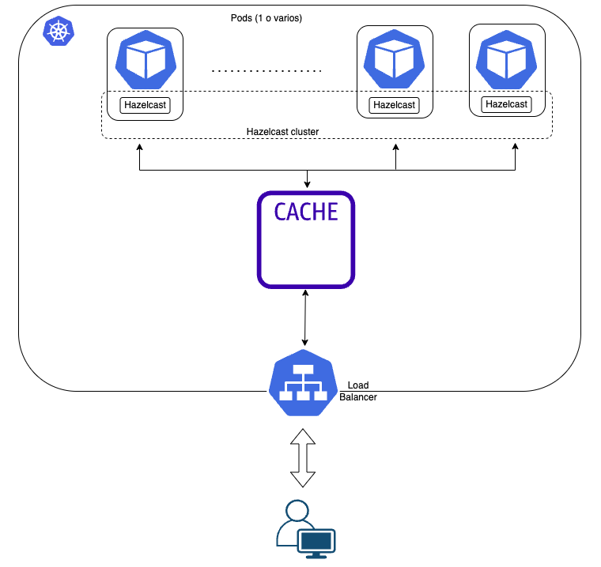
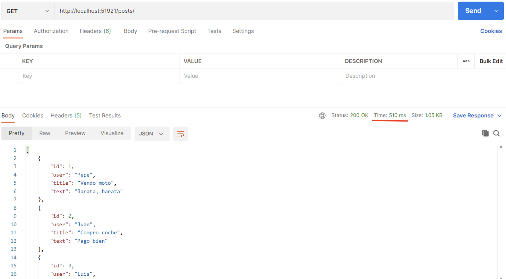
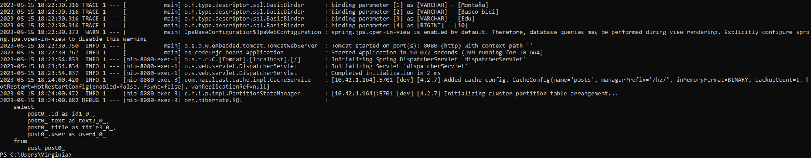
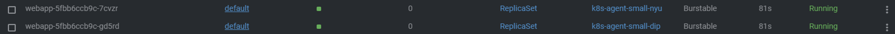
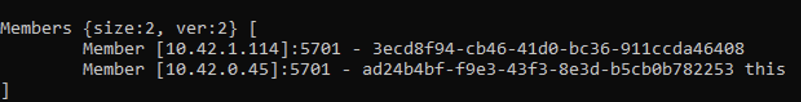
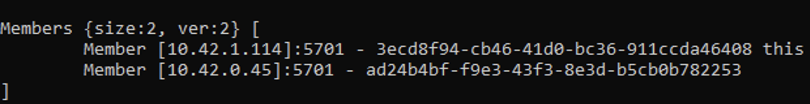
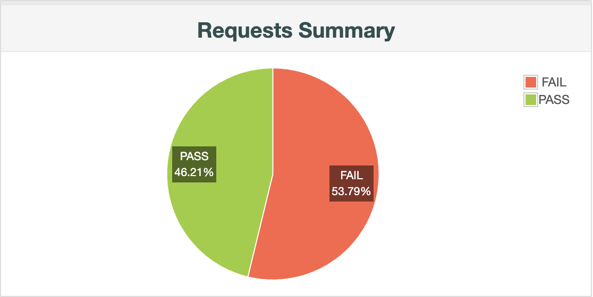
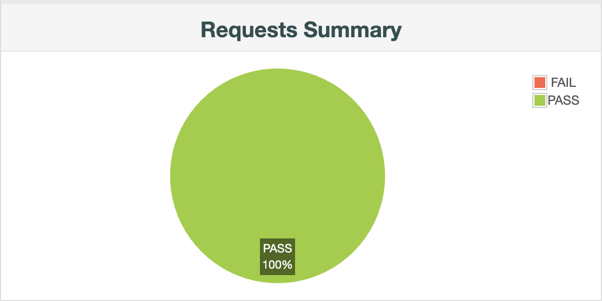
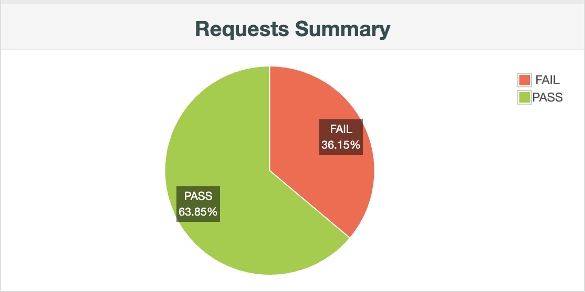
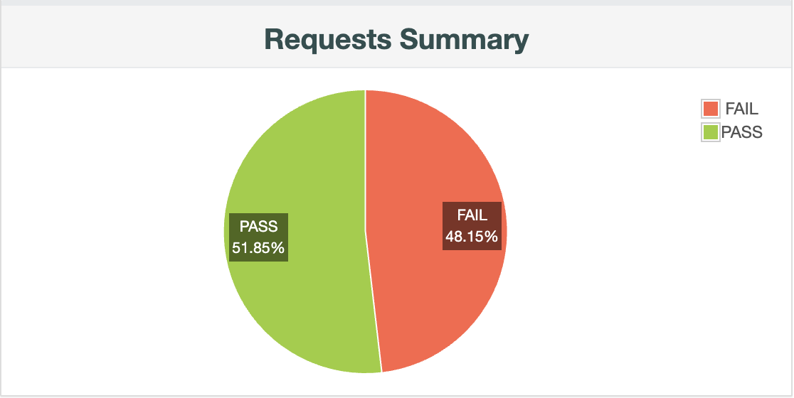

# WEB JCACHE CON HAZLECAST

En el siguiente ejemplo vamos a estudiar la escalabilidad y tolerancia a fallos de una web con caché, utilizando JCache con Spring y Hazelcast para el autodescubrimiento de pods dentro del clúster cuando se apliquen mecanismos de autoescalado, para así conseguir que la caché sea compartida entre todos ellos.


## ARQUITECTURA

Desde el punto de vista arquitectónio, la aplicación que vamos a montar para el estudio presenta la siguiente estructura:




## INSTALACIÓN

Posicionarse en la carpeta con los manifiestos de despliegue:
```
cd k8s
```

Desplegar la BD MySQL:
```
kubectl apply -f db.yaml
```

Desplegar el servicio de Hazelcast:
```
kubectl apply -f hazelcast-service.yaml
```

Desplegar la aplicación y el servicio para que el pod sea accesible desde el exterior:
```
kubectl apply -f webapp.yaml
```

Una vez tenemos la aplicación instalada, lo primero que haremos será probar el correcto funcionamiento de la caché. Para ello, realizamos mediante Postman una petición de tipo GET, obteniendo el siguiente tiempo de respuesta:



Volvemos a realizar la misma petición GET y vemos que el tiempo de respuesta mejora sustancialmente:


Volvemos a repetir peticiones GET, observando tiempos de respuesta similares al de la segunda petición. Además, si miramos los logs de la aplicación, vemos una única traza de la primera vez que ha tenido que ir a la MySQL a consultar los datos, pues las siguientes peticiones han devuelto los datos desde la caché:




> El código fuente de la aplicación puede encontrarse en la carpeta *javaCode*


## PRUEBAS DE CARGA

Una vez se ha instalado la aplicación, estudiamos el comportamineto de la misma mediante pruebas de carga en un escenario sin caos y en otro con caos. Todas las pruebas se han lanzado con una primera carga de 500 usuarios y posteriormente, duplicando la carga a 1000 usuarios. Para las pruebas de carga, establecemos un Ramp-up de 3 minutos, dato que tenemos que cambiar al introducir el caos, pues se observa que, con el tiempo que tarda en levantarse un pod con MySQL, tenemos que espaciar el delay matando pods, y el Ramp-up que establescemos en este caso es de 5 minutos. Los ficheros jmx utilizados para las pruebas de carga pueden encontrarse en la carpeta *Pruebas JMeter*

| TEST PLANS | FILE |
| --- | --- |
| Test plan 500 users - no chaos | [Go to file](./Pruebas%20JMeter/Test%20Plan%20webjcache%20-%20500%20users%20no-chaos.jmx) |
| Test plan 500 users - chaos | [Go to file](./Pruebas%20JMeter/Test%20Plan%20webjcache%20-%20500%20users%20-chaos.jmx) |
| Test plan 1000 users - no chaos | [Go to file](./Pruebas%20JMeter/Test%20Plan%20webjcache%20-%201000%20users%20no-chaos.jmx) |
| Test plan 1000 users - chaos | [Go to file](./Pruebas%20JMeter/Test%20Plan%20webjcache%20-%201000%20users%20-%20chaos.jmx) |


## Instalación de chaos-monkey
Instalación de la imagen que contiene el chaos-monkey

```
kubectl apply -f .\chaos\chaos.yml
```

Permisos RBAC
```
kubectl apply -f .\chaos\rbac.yml
```


## Escalado a 2 réplicas
```
kubectl scale deployments/webapp --replicas=2 -n default
```

Una vez hemos escalado a 2 el número de réplicas de la aplicación, comprobamos que ambas réplicas se han conectado correctamente a Hazelcast, y los pods se han autodescubierto entre ellos, con lo cual la caché es compartida entre ambos.



Si miramos en los logs del primer pod:



Si miramos en los logs del segundo pod:




## Resultados

A continuación, se muestra una comparativa del resultado de las pruebas:

| TEST PLAN| REPLICAS | NO-CAOS| CAOS |
| --- | --- | --- | --- |
| Test plan 500 users | 1 |  |  |
| Test plan 1000 users | 1 |  |  |
| Test plan 500 users | 2 |  |  |
| Test plan 1000 users | 2 |  |  |


## Análisis de los resultados

 - Como se puede observar, cuando no hay caos ninguna de las peticiones falla ni aunque se duplique el tráfico, pasando de 500 a 1000 usuarios.
 - El porcentaje de fallo al introducir una segunda réplica disminuye en comparación con el que se obtiene haciendo uso de una sola réplica.
 - En cuanto a tiempos de respuesta de las peticiones a lo largo del test, se nota una mejora de los mismos por el uso de una caché compartida.


## ¿Cómo podríamos mejorar estos resultados?

- Aumentar el número de réplicas la aplicación, puesto cuanto mayor sea el número de pods, menor será el número de errores que puedan producirse.
- Introducir algún service mesh, permitiendo reintento de peticiones fallidas.
- Implementar un patrón de Circuit Breaker para dejar de enviar peticiones a un servicio que esté fallando.


### Desinstalación

Borramos los manifiestos:
```
kubectl delete -f db.yaml
kubectl delete -f hazelcast-service.yaml
kubectl delete -f webapp.yaml
```


## CONCLUSIONES

- El uso de una caché compartida hace que el tiempo de respuesta de las peticiones GET disminuya notablemente, lo que mejora la performance de la aplicación.
- La escalabilidad es más compleja de implementar que en una web stateless por el uso de la caché compartida.
- La tolerancia a fallos es mayor cuantas más réplicas de nuestra aplicación tengamos.