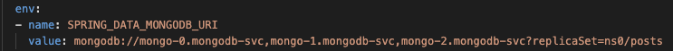
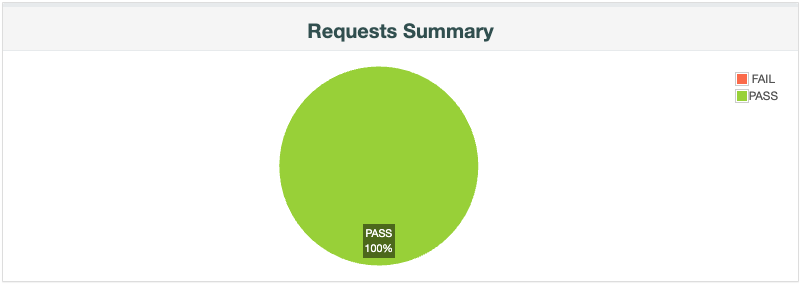

# WEB MONGODB REPLICASET

En el siguiente ejemplo, vamos a someter a estudio una aplicación que tiene persistencia de datos no relacional, mediante MongDB. Una vez hemos estudiado las limitaciones de tener una sóla réplica, vamos a estudiar una mejora que nos permite una mayor tolerancia a fallos utilizando el recurso StatefulSet de Kubernetes.

## ARQUITECTURA

Desde el punto de vista arquitectónico, la aplicación que vamos a montar para el estudio presenta la siguiente estructura:


## Cambios en el código

Para hacer este cambio de arquitectura, tenemos que adaptar nuestro código para que la aplicación pueda conectarse a todos los miembros del clúster de MogoDB.

En el aplication.properties de nuestra aplicación, haremos uso de una nueva propiedad de SpringBoot (spring.data.data.mongodb.uri), en la cual le indicaremos la cadena de conexión que especifica todos los miembros del clúster de MongoB.


Para pasarle el valor a esta propiedad, lo haremos mediante una variable de entorno en el manifiesto de despliegue que contenga la cadena de conexión:




## INSTALACIÓN
Posicionarse en la carpeta con los manifiestos de despliegue:
```
cd k8s
```

Crear el servicio headless
```
kubectl apply -f service-headless.yaml
```

Crear el servicio stateful con la configuración de MongoDB en formato clúster o replicaset
```
kubectl apply -f statefulset.yaml
```

Iniciar el replicaset en cada uno de los pods para que trabajen de manera conjunta como un clúster
```
kubectl exec -it mongo-0 mongo

rs.initiate({_id: "rs0", version: 1, members: [
  { _id: 0, host : "mongo-0.mongodb-svc.default.svc.cluster.local:27017" },
  { _id: 1, host : "mongo-1.mongodb-svc.default.svc.cluster.local:27017" },
  { _id: 2, host : "mongo-2.mongodb-svc.default.svc.cluster.local:27017" }
]});

rs.conf()
rs.status()
```

Desplegar la aplicación
```
kubectl apply -f .\webapp.yml
```

Insertar un nuevo elemento mediante POST en la BD

Conectarse a uno de los nodos secundarios y comprobar que el contenido se ha replicado satisfactoriamente
```
kubectl exec -it mongo-1 mongo
rs.secondaryOk()
show dbs
use posts
db.post.find()
```

> El código fuente de la aplicación puede encontrarse en la carpeta *javaCode*


## PRUEBAS DE CARGA

Una vez se ha instalado la aplicación, estudiamos el comportamineto de la misma mediante pruebas de carga en un escenario sin caos y en otro con caos. Todas las pruebas consisten en peticiones GET y POST a la aplicación. Se han lanzado, en primer lugar, con 500 usuarios y posteriormente, duplicando la carga a 1000 usuarios en un Ramp-up de 10 minutos.
Los ficheros jmx utilizados para las pruebas de carga pueden encontrarse en la carpeta *Pruebas JMeter*


| TEST PLAN | FILE|
| --- | --- |
| Test plan 500 users | [Go to file](./Pruebas%20JMeter/Test%20MongoDB%20replicaset%20-%20500%20users.jmx) |
| Test plan 1000 users | [Go to file](./Pruebas%20JMeter/Test%20MongoDB%20replicaset%20-%201000%20users.jmx) |


## Instalación de chaos-monkey

Instalación de la imagen que contiene el chaos-monkey
```
kubectl apply -f .\chaos\chaos.yml
```

Permisos RBAC
```
kubectl apply -f .\chaos\rbac.yml
```


## Resultados

A continuación, se muestra una comparativa del resultado de las pruebas:

| TEST PLAN | NO-CHAOS| CHAOS |
| --- | --- | --- |
| Test plan 500 users |  |  |
| Test plan 1000 users |  |  |


## Análisis de los resultados

 - Como se puede observar, no hay fallo de peticiones ni en los escenarios sin caos ni en los que introducen caos. Esto es porque al matar a uno de los nodos, otro se vuelve el primario de una manera muy rápida
 - Es altamente tolerante a fallos


## ¿Cómo podríamos mejorar estos resultados?

- Se podría aumentar el número de réplicas para reducir las probabilidades de fallo al introducir cargas muy altas. Intuimos que si aumentamos mucho la carga, de tal manera que metamos gran número de usuarios en poco espacio de tiempo (cosa que con nuestras máquinas no hemos podido probar, pues se nos cualega antes el JMeter), podría producirse algún error, pero el porcentaje de fallo sería muy pequreño, pues la MongoDB es muy rápida en designar a un nuevo nodo primario.


## DESINSTALACIÓN
Para desinstalar la aplicación ejecutamos los siguientes comandos
```
kubectl delete -f service-headless.yaml
kubectl delete -f statefulset.yaml
kubectl delete -f .\webapp.yml
```


## CONCLUSIONES

- Es una de las soluciones más tolerante a fallos de las que hemos estudado.
- La escabilidad es algo compleja al introducir el replicaset.