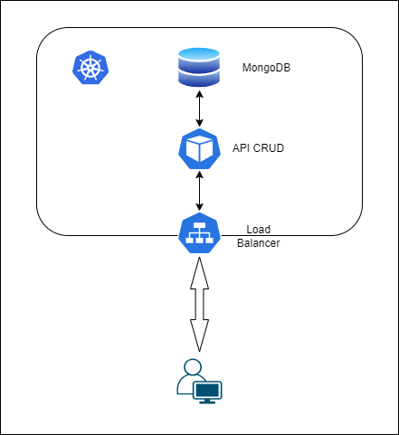
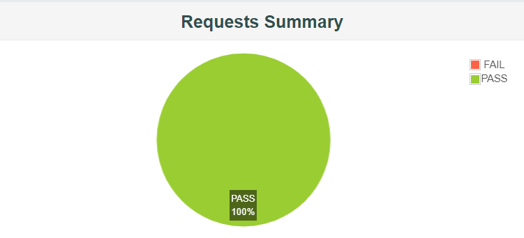

# WEB MONGODB STANDALONE

En este ejemplo vamos a estudiar la tolerancia a fallos de una API cuya persistencia de datos se hace en una base de datos no relacional sin replicación. Como base de datos no relacional hemos elegido MongoDB.


## ARQUITECTURA

Desde el punto de vista arquitectónico, la aplicación que vamos a montar para el estudio presenta la siguiente estructura:




## INSTALACIÓN

### Mediante manifiestos de despliegue

Crear el namespace mongodb-standalone:
```sh
kubectl create namespace mongodb-standalone
```

Desplegamos la base de datos mediante el yaml: mongoDB.yaml 
```sh
kubectl apply -f ./k8s/mongoDB.yml
```

Desplegar la aplicación y el servicio para acceder a ella con el yaml: webapp.yaml

```sh
kubectl apply -f ./k8s/webapp.yml
```

Hacer un port forward para acceder al servicio desde un navegador:
```sh
kubectl port-forward service/webapp 8080:8080 -n mongodb-standalone
```

> El código fuente de la aplicación puede encontrarse en la carpeta *javaCode*


## PRUEBAS DE CARGA

Una vez se ha instalado la aplicación, estudiamos el comportamineto de la misma mediante pruebas de carga en un escenario sin caos y en otro con caos. Todas las pruebas consisten en peticiones GET y POST a la aplicación. Se han lanzado, en primer lugar, con 500 usuarios y posteriormente, duplicando la carga a 1000 usuarios en un Ramp-up de 10 minutos. 
Los ficheros jmx utilizados para las pruebas de carga pueden encontrarse en la carpeta *Pruebas JMeter*

| TEST PLAN| NO-CAOS| CAOS |
| --- | --- | --- |
| Test plan 500 users | [Go to file](./Pruebas%20JMeter/TestMongoDBstandalone-500Users-No-Chaos.jmx) | [Go to file](./Pruebas%20JMeter/TestMongoDBstandalone-500Users-Chaos.jmx) |
| Test plan 1000 users | [Go to file](./Pruebas%20JMeter/TestMongoDBstandalone-1000Users-No-Chaos.jmx) | [Go to file](./Pruebas%20JMeter/TestMongoDBstandalone-1000Users-Chaos.jmx) |

### Instalación de Chaos Monkey

Instalación de la imagen que contien el chaos-monkey
```sh
kubectl apply -f ./k8s/chaos/chaos.yml
```
Permisos RBAC
```sh
kubectl apply -f ./k8s/chaos/rbac.yml
```

### Resultados 

A continuación, vamos a comparar el resultado de las pruebas:

| TEST PLAN | NO-CHAOS | CHAOS |
| --- | --- | --- |
| Test plan 500 users |  |  |
| Test plan 1000 users |  |  |

### Análisis de los resultados 
- En ninguna de las pruebas provocamos fallos. Esto se debe a que nuestra base de datos MongoDB es muy pequeña y se vuelve a recuperar en tiempos muy bajos.

### ¿Cómo podríamos mejorar estos resultados?
- Aunque los resultados ya son muy buenos, no es despliegue apto para producción porque no tiene tolerancia a fallos. Por lo que deberíamos añadir a este despliegue la replicación de la base de datos.


## DESINSTALACIÓN

Para desinstalar la aplicación, ejecutamos los siguientes comandos:

```sh
kubectl delete -f ./k8s/mongoDB.yml
kubectl delete -f ./k8s/webapp.yml
```

Borrar el namespace
```sh
kubectl delete namespace mongodb-standalone
```


## CONCLUSIONES

- Las bases de datos MongoDB tienen un tiempo de recuperación mínimo por lo que es difícil hacerlas fallar.
- No es una arquitectura apta para producción, ya que carece de replicación y no es tolerante a fallos.