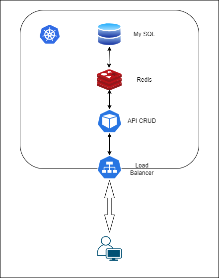
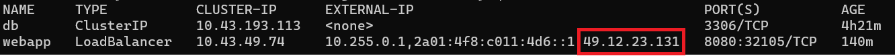
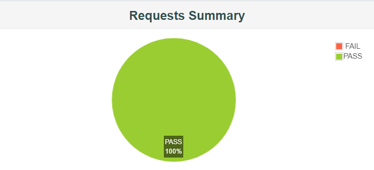
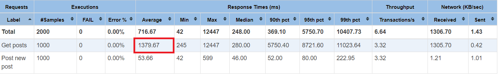

# WEB MONGODB CON CACHÉ REDIS

En este ejemplo vamos a estudiar la tolerancia a fallos de una API cuya persistencia de datos se hace en una base de datos no relacional y por delante le ponemos una caché redis. Como base de datos no relacional hemos elegido MongoDB.


## ARQUITECTURA

Desde el punto de vista arquitectónico, la aplicación que vamos a montar para el estudio presenta la siguiente estructura:




## INSTALACIÓN

### Mediante manifiestos de despliegue

Crear el namespace mysql-standalone:
```sh
kubectl create namespace mongoredis
```

Desplegamos redis: redis.yaml 
```sh
kubectl apply -f ./k8s/redis.yaml
```

Desplegamos la base de datos MongoDB: mongoDB.yaml 
```sh
kubectl apply -f ./k8s/mongoDB.yaml
```

Desplegar la aplicación y el servicio que para acceder a ella con el yaml: webapp.yaml

```sh
kubectl apply -f ./k8s/webapp.yaml
```

> NOTA: Al desplegar la aplicación con un servicio de tipo Load Balancer tenemos que averiguar que IP de acceso nos ha dado Kubernetes

Para averiguar la IP que nos expone el clúster, lanzamos el siguiente comando:
```sh
kubectl get services -n mongoredis
```


> El código fuente de la aplicación puede encontrarse en la carpeta *javaCode*


## PRUEBAS DE CARGA

Una vez se ha instalado la aplicación, estudiamos el comportamineto de la misma mediante pruebas de carga en un escenario sin caos y en otro con caos. Todas las pruebas consisten en peticiones GET y POST a la aplicación. Se han lanzado, en primer lugar, con 500 usuarios y posteriormente, duplicando la carga a 1000 usuarios con un Ramp-up de 5 minutos. 
Los ficheros jmx utilizados para las pruebas de carga pueden encontrarse en la carpeta *Pruebas JMeter*

| TEST PLAN| NO-CAOS| CAOS |
| --- | --- | --- |
| Test plan 500 users | [Go to file](./Pruebas%20JMeter/TestPlanWebMongoRedis-500Users-No-Chaos.jmx) | [Go to file](./Pruebas%20JMeter/TestPlanWebMongoRedis-500Users-Chaos.jmx) |
| Test plan 1000 users | [Go to file](./Pruebas%20JMeter/TestPlanWebMongoRedis-500Users-No-Chaos.jmx) | [Go to file](./Pruebas%20JMeter/TestPlanWebMongoRedis-1000Users-Chaos.jmx) |

### Instalación de Chaos Monkey

Instalación de la imagen que contien el chaos-monkey
```sh
kubectl apply -f ./k8s/chaos/chaos.yml
```
Permisos RBAC
```sh
kubectl apply -f ./k8s/chaos/rbac.yml
```

### Resultados 

A continuación, vamos a comparar el resultado de las pruebas:

| TEST PLAN| NO-CHAOS| CHAOS |
| --- | --- | --- |
| Test plan 500 users |  |  |
| Test plan 1000 users |  |  |


### Análisis de los resultados 

- Como se puede observar, cuando no hay caos el despliegue no falla aunque haya 1000 usuarios concurrentes.
- Al habilitar chaos monkey tampoco conseguimos hacer la aplicación pero si nos fijamos en detalle en los resultado de los tests vemos que el tiempo medio de respuesta es muy alto.


 

### ¿Cómo podríamos mejorar estos resultados?

- Para reducir la latencia de las peticiones tendríamos que montar la replicación de la caché de redis.

> No hemos podido realizar este estudio ya que el sentinel de redis requiere 4 GB de RAM y nuestras máquinas del clúster no disponen de dicha memoria.


## DESINSTALACIÓN

Para desinstalar la aplicación, ejecutamos los siguientes comandos:

```sh
kubectl delete -f ./k8s/redis.yaml
kubectl delete -f ./k8s/mongoDB.yaml
kubectl delete -f ./k8s/webapp.yaml
```

Borrar el namespace
```sh
kubectl delete namespace mongoredis
```

## CONCLUSIONES

- Los resultados de las pruebas mejorarían al introducir un mecanismo de replicación en la caché, aún así con una única réplica notamos una mejora en los tiempos de respuesta de las peticiones GET respecto a las pruebas realizadas sólo contra la base de datos.
