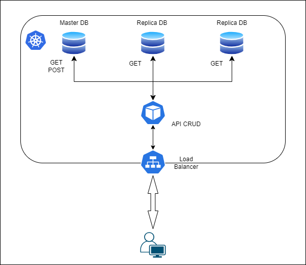
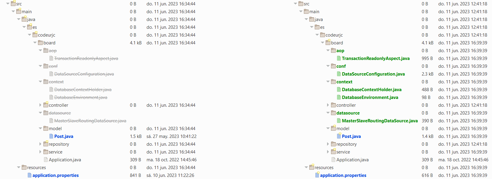
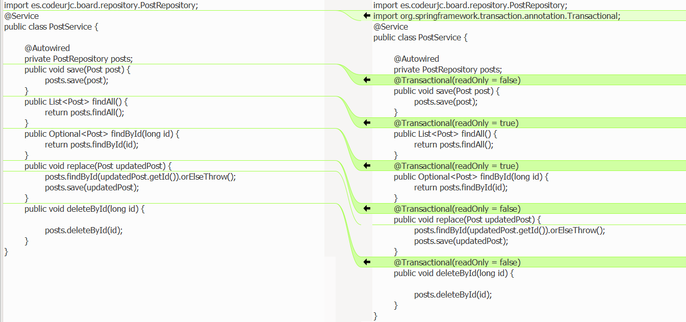
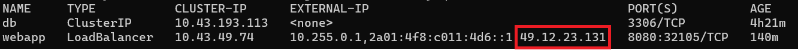
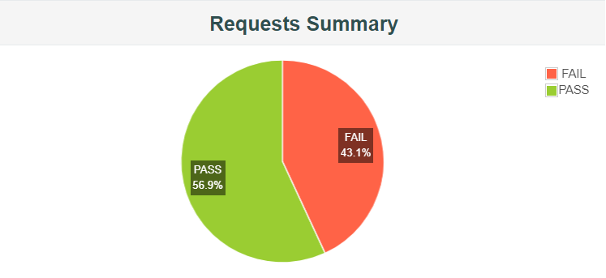
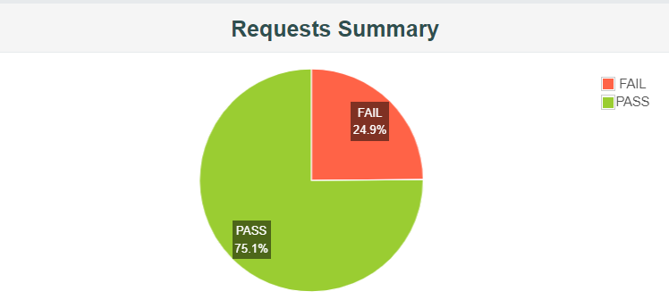
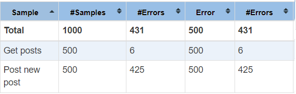
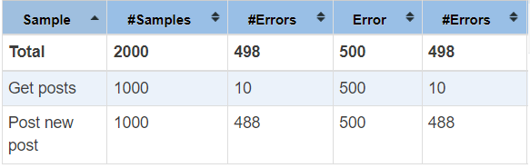

# WEB MYSQL REPLICASET

En este ejemplo vamos a estudiar la tolerancia a fallos de una API cuya persistencia de datos se hace con una base de datos relacional con replicación. Como base de datos relacional hemos elegido MySQL.


## ARQUITECTURA

Desde el punto de vista arquitectónico, la aplicación que vamos a montar para el estudio presenta la siguiente estructura:



En esta arquitectura las peticiones POST, PUT y DELETE se realizarán **sólo** en la base de datos master y las peticiones GET se realizarán en las réplicas.

## Cambios en el código

Para hacer este cambio de arquitectura, tenemos que adaptar nuestro código ya que, por defecto, JPA no acepta dos conexiones a bases de datos.



Las clases más importante en esta transformación son:
- [TransactionReadonlyAspect.java](./javaCode/src/main/java/es/codeurjc/board/aop/TransactionReadonlyAspect.java). Clase encargada de cambiar entre la base de datos master o las réplicas según este indicado en la propiedad @Transactional indicada en la clase PostService.java.
- [DataSourceConfiguration.java](./javaCode/src/main/java/es/codeurjc/board/conf/DataSourceConfiguration.java). Es la clase encargada de leer los nuevos parámetros del properties y cargar esos valores en un hashmap.
- [PostService.java](./javaCode/src/main/java/es/codeurjc/board/service/PostService.java). Debemos anotar las peticiones POST con la anotación **@Transactional(readOnly = false)** y las peticiones GET con **@Transactional(readOnly = true)**.




## INSTALACIÓN

Para desplegar la replicación de la base de datos MySQL utilizamos la helm chart [mysql](https://artifacthub.io/packages/helm/bitnami/mysql) oficial de bitnami

El comando para instalar el chart sería:


Instalar la base de datos con replicación:
```sh
helm upgrade --install mysql oci://registry-1.docker.io/bitnamicharts/mysql -f ./k8s/values-mysql.yaml --create-namespace --namespace replication
```

Desplegar la aplicación y el servicio con el yaml: webapp.yaml

```sh
kubectl apply -f ./k8s/webapp.yaml
```

> NOTA: Al desplegar la aplicación con un servicio de tipo Load Balancer tenemos que averiguar que IP de acceso nos ha dado Kubernetes

Para averiguar la IP que nos expone el clúster lanzamos el siguiente comando:
```sh
kubectl get services -n mysql-standalone
```


> El código fuente de la aplicación puede encontrarse en la carpeta *javaCode*


## PRUEBAS DE CARGA

Una vez se ha instalado la aplicación, estudiamos el comportamineto de la misma mediante pruebas de carga en un escenario sin caos y en otro con caos. Todas las pruebas consisten en peticiones GET y POST a la aplicación. Se han lanzado, en primer lugar, con 500 usuarios y posteriormente, duplicando la carga a 1000 usuarios en un Ramp-up de 10 minutos. 
Los ficheros jmx utilizados para las pruebas de carga pueden encontrarse en la carpeta *Pruebas JMeter*

| TEST PLAN| NO-CAOS| CAOS |
| --- | --- | --- |
| Test plan 500 users | [Go to file](./Pruebas%20JMeter/TestPlanMySqlstandalone-500Users-No-Chaos.jmx) | [Go to file](./Pruebas%20JMeter/TestPlanMySqlstandalone-500Users-Chaos.jmx) |
| Test plan 1000 users | [Go to file](./Pruebas%20JMeter/TestPlanMySqlstandalone-1000Users-No-Chaos.jmx) | [Go to file](./Pruebas%20JMeter/TestPlanMySqlstandalone-1000Users-Chaos.jmx) |

### Instalación de Chaos Monkey

Instalación de la imagen que contien el chaos-monkey
```sh
kubectl apply -f ./k8s/chaos/chaos.yml
```
Permisos RBAC
```sh
kubectl apply -f ./k8s/chaos/rbac.yml
```

### Resultados 

A continuación, vamos a comparar el resultado de las pruebas:

| TEST PLAN | NO-CHAOS | CHAOS |
| --- | --- | --- |
| Test plan 500 users |  |  |
| Test plan 1000 users |  |  |

### Análisis de los resultados 

- Como se puede observar, cuando no hay caos el despliegue no falla en las peticiones GET y POST aunque haya 1000 usuarios concurrentes.
- Al habilitar caos empezamos a tener errores. Aunque las gráficas nos pueden llevar a engaños, si observamos más detenidamente los datos vemos que el número de fallos con 500 y 1000 usuarios es similar en ambos casos.

| TEST PLAN | STATISTICS |
| --- | --- | 
| Test plan 500 users |  |
| Test plan 1000 users |  |


### ¿Cómo podríamos mejorar estos resultados?
- Con las pruebas se ha demostrado que los errores se producen principalmente en los métodos POST, ya que el nodo maestro no tiene replicación. Para mejorar la tolerancia al fallo, podríamos estudiar la georedudancia de la infraestructura.
- Aunque los errores en las peticiones GET son mínimos, podríamos mejorar aún más los resultados si añadimos algún tipo de caché (JCache, Redis) a nuestra aplicación. 


## DESINSTALACIÓN

Para desinstalar la aplicación, ejecutamos los siguientes comandos:

```sh
helm delete mysql
```

Borrar el namespace
```sh
kubectl delete namespace replication
```


## CONCLUSIONES

- Como hemos podido demostrar con las pruebas, esta arquitectura es mucho más tolerante al fallo que la standalone.
- Es una arquitectura más acorde a un entorno de producción.
- Esta solución es más "económica", ya que con las mismas máquinas se producen menos fallos.
- Aunque las bases de datos MySQL se pueden instalar en Kubernetes, nuestra experiencia nos dice que de momento son bastante complicadas de gestionar.