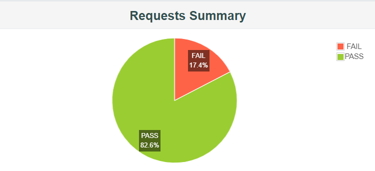
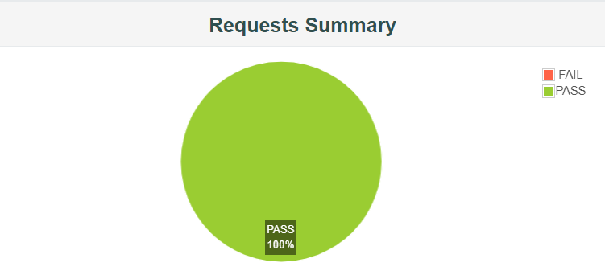

# WEB MYSQL STANDALONE

En este ejemplo vamos a estudiar la tolerancia a fallos de una API cuya persistencia de datos se hace en una base de datos relacional sin replicación. Como base de datos relacional hemos elegido MySQL.


## ARQUITECTURA

Desde el punto de vista arquitectónico, la aplicación que vamos a montar para el estudio presenta la siguiente estructura:


## INSTALACIÓN

### Mediante manifiestos de despliegue

Crear el namespace mysql-standalone:
```sh
kubectl create namespace mysql-standalone
```

Desplegamos la base de datos mediante el yaml: db.yaml 
```sh
kubectl apply -f ./k8s/db.yaml
```

Desplegar la aplicación y el servicio que para acceder a ella con el yaml: webapp.yaml

```sh
kubectl apply -f ./k8s/webapp.yaml
```

> NOTA: Al desplegar la aplicación con un servicio de tipo Load Balancer tenemos que averiguar que IP de acceso nos ha dado Kubernetes

Para averiguar la IP que nos expone el clúster, lanzamos el siguiente comando:
```sh
kubectl get services -n mysql-standalone
```


> El código fuente de la aplicación puede encontrarse en la carpeta *javaCode*


## PRUEBAS DE CARGA

Una vez se ha instalado la aplicación, estudiamos el comportamineto de la misma mediante pruebas de carga en un escenario sin caos y en otro con caos. Todas las pruebas consisten en peticiones GET y POST a la aplicación. Se han lanzado, en primer lugar, con 500 usuarios y posteriormente, duplicando la carga a 1000 usuarios con un Ramp-up de 5 minutos. 
Los ficheros jmx utilizados para las pruebas de carga pueden encontrarse en la carpeta *Pruebas JMeter*

| TEST PLAN| NO-CAOS| CAOS |
| --- | --- | --- |
| Test plan 500 users | [Go to file](./Pruebas%20JMeter/TestPlanMySqlstandalone-500Users-No-Chaos.jmx) | [Go to file](./Pruebas%20JMeter/TestPlanMySqlstandalone-500Users-Chaos.jmx) |
| Test plan 1000 users | [Go to file](./Pruebas%20JMeter/TestPlanMySqlstandalone-1000Users-No-Chaos.jmx) | [Go to file](./Pruebas%20JMeter/TestPlanMySqlstandalone-1000Users-Chaos.jmx) |

### Instalación de Chaos Monkey

Instalación de la imagen que contien el chaos-monkey
```sh
kubectl apply -f ./k8s/chaos/chaos.yml
```
Permisos RBAC
```sh
kubectl apply -f ./k8s/chaos/rbac.yml
```

### Resultados 

A continuación, vamos a comparar el resultado de las pruebas:

| TEST PLAN| NO-CHAOS| CHAOS |
| --- | --- | --- |
| Test plan 500 users |  |  |
| Test plan 1000 users |  |  |


### Análisis de los resultados 

- Como se puede observar, cuando no hay caos el despliegue no falla aunque haya 1000 usuarios concurrentes.
- Como es obvio, al habilitar el chaos-monkey empezamos a encontrar errores tanto en las peticiones GET como en las POST. A mayor número de usuarios concurrentes, mayor es el número de fallos que se producen. 


### ¿Cómo podríamos mejorar estos resultados?

- Aumentar la capacidad de las máquinas del clúster.
  - En nuestro caso, el clúster está formado por máquinas con 4GB de RAM, esto hace que la base de datos MySQL tarde bastante en volver a estar disponible tras un reinicio. 
- Cuando no podemos aumentar la capacidad de nuestro clúster, podemos optar por la replicación de la base de datos.
- Para aumentar la tolerancia al fallo también podemos añadir a nuestro despliegue una caché (Redis, Hazelcast, etc). Los métodos POST seguirían fallando pero las peticiones GET no darían error. 


## DESINSTALACIÓN

Para desinstalar la aplicación, ejecutamos los siguientes comandos:

```sh
kubectl delete -f ./k8s/db.yaml
kubectl delete -f ./k8s/webapp.yaml
```

Borrar el namespace
```sh
kubectl delete namespace mysql-standalone
```


## CONCLUSIONES

- Las bases de datos MySQL consumen una gran cantidad de recursos por lo que es necesario tener máquinas potentes.
- Como hemos podido demostrar con las pruebas, no es una arquitectura tolerante a fallos, por lo que no es recomendable en entornos de producción. 