# WEB STATELESS GATOS

En el siguiente ejemplo vamos a estudiar la escalabilidad y tolerancia a fallos de una web stateless. Es uno de los tipos de arquitectura más sencillos, al caracterizarse por no tener estado; con lo cual, el servidor únicamente se basa en la petición que se realiza con cada solicitud, sin tener en cuenta información anterior o peticiones anteriores; es decir, el servidor no necesita información de estado de otras solicitudes.


## ARQUITECTURA

Desde el punto de vista arquitectónico, la aplicación que vamos a montar para el estudio presenta la siguiente estructura:

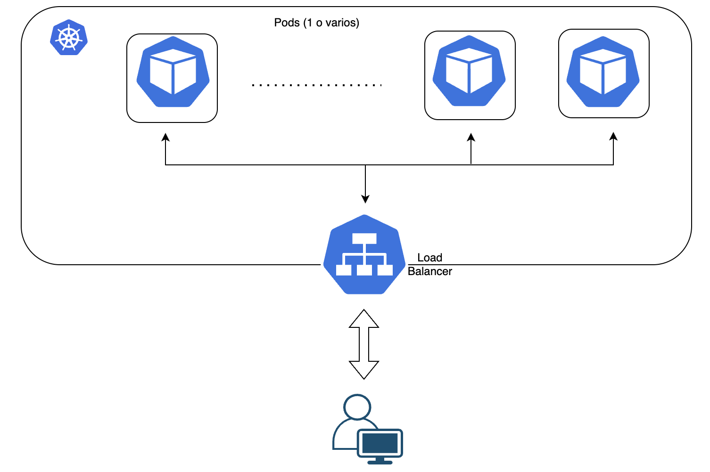


## INSTALACIÓN

### Mediante manifiestos de despliegue

Posicionarse en la carpeta con los manifiestos de despliegue:
```
cd k8s
```

Crear el namespace webgatos:
```
kubectl create namespace webgatos
```

Desplegar el deployment webgatos_1_replica.yml:
```
kubectl apply -f webgatos_1_replica.yml
```

Desplegar el servicio de tipo LoadBalancer para que el pod sea accesible desde el exterior:
```
kubectl apply -f webgatos_service.yml
```

Hacer un port forward para acceder al servicio desde un navegador:
```
kubectl port-forward service/webgatos-service 5000:56981
```

### Mediante templates de Helm

El ejemplo anterior también se puede instalar haciendo uso de charts de Helm en lugar de con los manifiestos de despliegue

Instalar la release
```
helm upgrade --install webgatos --create-namespace -n webgatos --values .\Helm\webgatos.yaml
```

> El código fuente de la aplicación puede encontrarse en la carpeta *webgatosCode*


## PRUEBAS DE CARGA

Una vez se ha instalado la aplicación, estudiamos el comportamineto de la misma mediante pruebas de carga en un escenario sin caos y en otro con caos. Todas las pruebas se han lanzado con una primera carga de 500 usuarios y posteriormente, duplicando la carga a 1000 usuarios en un Ramp-up de 3 minutos. Los ficheros jmx utilizados para las pruebas de carga pueden encontrarse en la carpeta *Pruebas JMeter*

| TEST PLAN| FILE|
| --- | --- |
| Test plan 500 users | [Go to file](./Pruebas%20JMeter/Test%20Plan%20webgatos%20-%20500%20users.jmx) |
| Test plan 1000 users | [Go to file](./Pruebas%20JMeter/Test%20Plan%20webgatos%20-%201000%20users.jmx) |


## Instalación de chaos-monkey
Instalación de la imagen que contiene el chaos-monkey

```
kubectl apply -f .\chaos\chaos.yml
```

Permisos RBAC
```
kubectl apply -f .\chaos\rbac.yml
```


## Resultados

A continuación, se muestra una comparativa del resultado de las pruebas:

| TEST PLAN| REPLICAS | NO-CAOS| CAOS |
| --- | --- | --- | --- |
| Test plan 500 users | 1 | 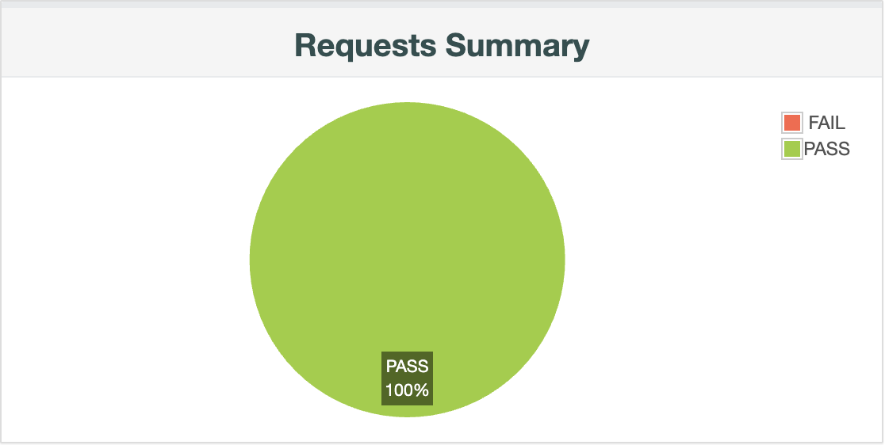 | 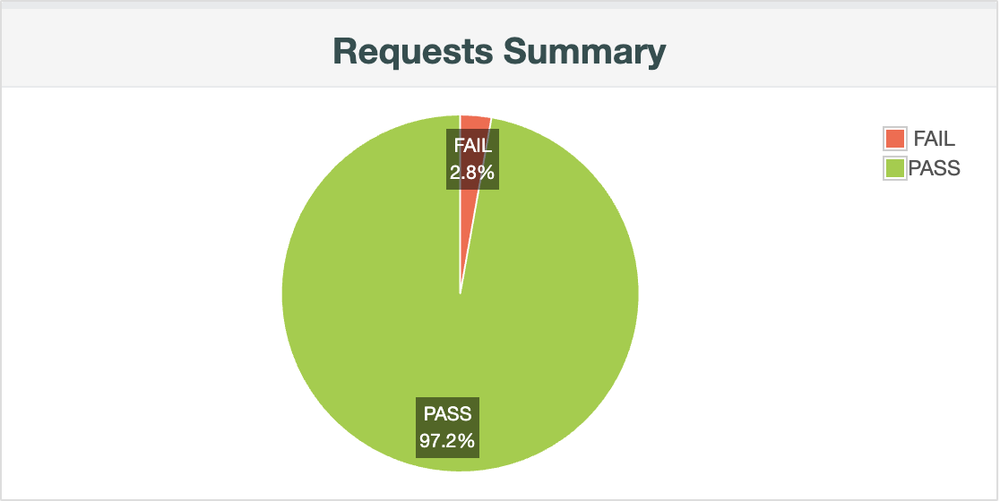 |
| Test plan 1000 users | 1 |  | 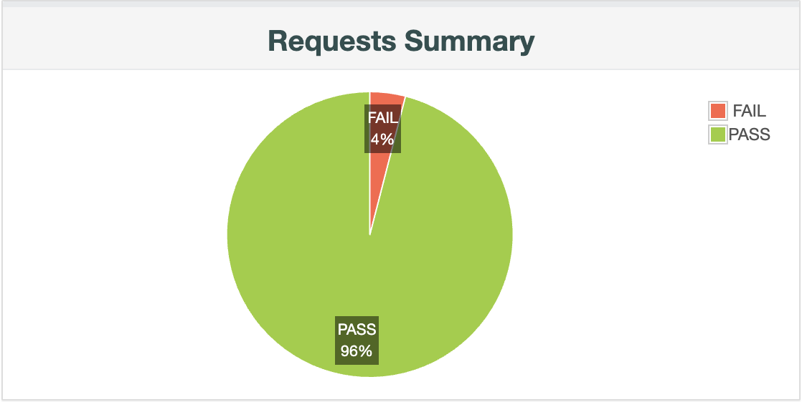 |
| Test plan 500 users | 2 |  |  |
| Test plan 1000 users | 2 |  | 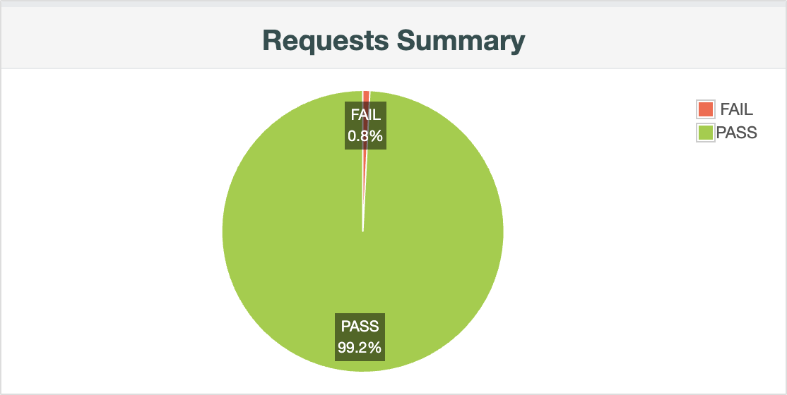 |


## Análisis de los resultados

 - Como se puede observar, cuando no hay caos ninguna de las peticiones falla ni aunque se duplique el tráfico, al pasar de 500 a 1000 usuarios.
 - Al introducir chaos-monkey las peticiones empiezan a fallar. El porcentaje de fallo es muy pequeño, dado que la aplicación es stateless, no maneja estados, no tiene persistencia de datos y tarda muy poco en levantar un nuevo pod cuando este se mata.
 - El porcentaje de fallo al introducir una segunda réplica disminuye en comparación con el que se obtiene en las pruebas con una sola réplica.


## ¿Cómo podríamos mejorar estos resultados?

- Aumentar el número de réplicas la aplicación, puesto que cuanto mayor sea el número de pods, menor será el número de errores que puedan producirse.
- Introducir algún service mesh, permitiendo reintento de peticiones fallidas.
- Implementar un patrón de Circuit Breaker para dejar de enviar peticiones a un servicio que esté fallando.


## AUTOESCALADO MEDIANTE HPA

En este apartado vamos a estudiar el autoescalado horizontal mediante un HPA que añadirá réplicas de nuestra aplicación en función de la carga de la CPU.

Aplicamos el manifiesto con el HPA:
```
kubectl apply -f .\HPA\hpa-autoscaling.yaml
```

Vemos que el HPA se ha creado correctamente:
```
kubectl get hpa webgatos --watch
```

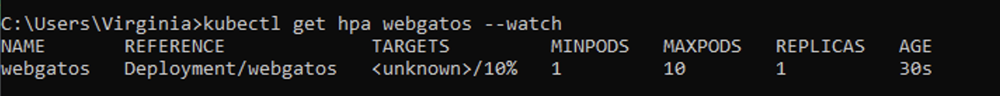

Partimos de un solo pod:

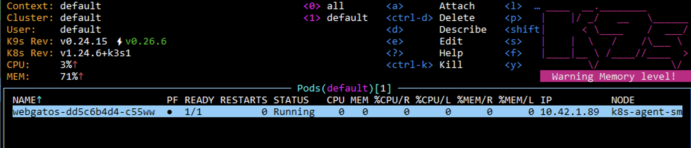
 
Simulamos carga:
```sh
kubectl run -i --tty load-generator --rm --image=busybox:1.28 --restart=Never -- /bin/sh -c "while sleep 0.01; do wget -q -O- http://167.235.217.41:5000; done"
```

Vemos como el número de réplicas va aumentando según la aplicación va recibiendo más carga, hasta llegar a 10 réplicas, que es el máximo que hemos definido en el HPA:

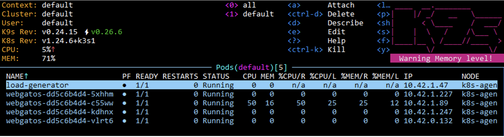

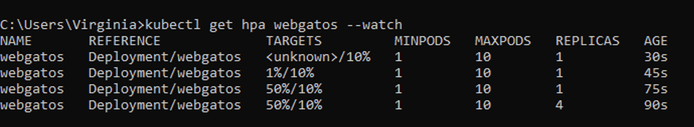

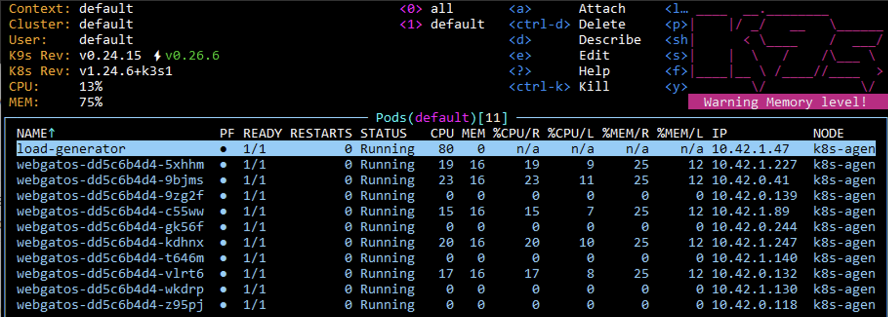

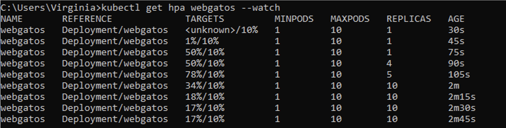
 
Una vez paramos de simular carga, vemos cómo comienza a desescalar hasta quedarse en 1 réplica, que es el mínimo que tenemos definido en el HPA:

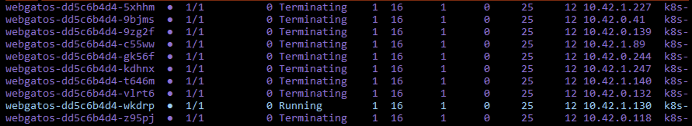

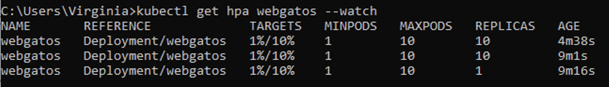 


## DESINSTALACIÓN

### Desinstalación de los manifiestos de despliegue

Borramos los manifiestos:
```
kubectl delete -f webgatos_1_replica.yaml
kubectl apply -f webgatos_service.yml
```

### Desinstalación del chart de Helm

Borrar la release
```
helm uninstall webgatos -n webgatos
```


## CONCLUSIONES

- Es una de las soluciones más sencillas de implementar.
- Es fácilmente escalable al no gestionar estados.
- Al escalar por métricas propias de Kubenetes es importante establecer límites de recursos en los pods.
- La tolerancia a fallos es mayor cuantas más réplicas de nuestra aplicación tengamos.